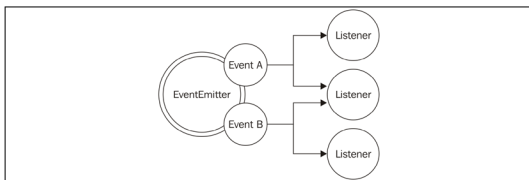

# Asynchronous Control Flow Patterns with Promises and Async/Await
Promise is an object that gives back result or error of an asynchronous operation. It can be `fulfilled`, `rejected` or `settled` or `pending`.

Async/await is speccial type expression that allows to use await to 'pause'.

Blocking is when the execution of additional JavaScript in the Node.js process must wait until a non-JavaScript operation completes.
In Node.js, JavaScript that exhibits poor performance due to being CPU intensive rather than waiting on a non-JavaScript operation, such as I/O, isn't typically referred to as blocking.
# Callbacks and events

## The observer
The Observer pattern defines an object (called subject) that can notify
a set of observers (or listeners) when a change in its state occurs.

```javascript
import { EventEmitter } from 'events'
const emitter = new EventEmitter()
```

## EventEmitter
EventEmitter if not unsubscribed can lead to memory leaks. Memory leaks is the
moment when some variable is referenced in the listener and its memory is retained until listener is released from emitter or when emitter is garbage collected.
This can happen when there is no active reference to it. The memory used by app will grow to the point when it will crash the app.


