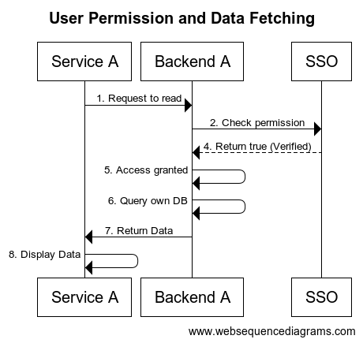

#Permission models
RBAC (Role-Based Access Control) is a commonly used security permissions model for both desktop and web applications. In RBAC, users are associated with roles, and roles are assigned permissions. Users can also belong to multiple groups, and groups can have multiple roles.

Another relevant concept is ACL (Access Control Lists), commonly used in Windows-based systems, where each object has an ACL that specifies which users or groups have access to it.

RBAC and ACL are different models, and you can find more information on their differences here. There are various other security models available, such as Lampson's Access Control Matrix, Capability Systems, Security Rings, Denning's Lattice, Bell-LaPadula, Biba Model, Type Enforcement, Chinese Wall, LOMAC, high-watermark, and Clark-Wilson.

If you want more in-depth information on these models, I recommend reading "Computer security: art and science" by Matt Bishop. Additionally, you can refer to the provided links for more information on security in Android and Microsoft systems.

---

### RBAC Theoretical Discussion Draft

#### 1. Roles

- **Admin**
    - Privilege: Assign roles to users.
    - Scope: Specific to certain services (Service A, Service B, etc.) or across all services.

- **User**
    - Privilege: Read and write to the database.
    - Scope: Not role-assignable, but will have specific access to services based on assigned role.

- **Guest**
    - Privilege: Read-only access.
    - Scope: Limited to certain data and services.

**Note**: These roles stored in a database.

#### 2. Role Scope and Privileges Requirement

- Information about what privileges are required for accessing specific endpoints in services (e.g., reading, writing, etc.) will be stored.
- The scope of a given role (e.g., which services an admin can assign roles in) needs to be defined and stored in the database as well.

#### 3. Implementation of Access Checks (`whatUserCan` function)

- A function named `whatUserCan` that takes a token as input.
- This function will validate the token, look up the user’s role and scope, and determine whether access to a particular resource is permitted.
- The function should return `true` if access is permitted, otherwise return `false`.

---
